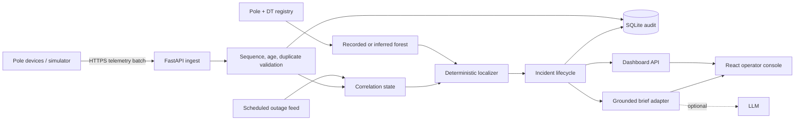

# Architecture

## System shape

The deployed artifact is one container. Vite builds static React assets; FastAPI
serves those assets and the API on port 8000. SQLite stores accepted telemetry
and the latest incident snapshot on a named volume. Current correlation state is
materialized in one process and reseeded after a process restart; the audit is
durable, but replay is not implemented. That is the largest demo/production gap.

## Data and ingestion

The seed is deterministic: 2,160 poles, 30 DTs, six feeders, two asymmetric LT
circuits per DT with bent trunks and lateral branches, approximately 91% device
coverage, 8% firmware 1.2, 3% missing PIN codes, 60% missing recorded topology,
and 4% of installed devices independently silent at startup. Inference keeps
near-transformer roots in separate angular sectors, preventing physically
separate circuits from being cross-linked. Silent devices remain unknown rather
than dark, so they add uncertainty without creating false fault tickets.

For each telemetry event the ingest path:

1. validates the pole FK and timestamp;
2. rejects events more than 10 minutes old or 5 minutes in the future, covering
   six-hour retries while allowing the stated 90-second skew;
3. de-duplicates on `(device_id, event, seq, ts)`;
4. rejects a non-boot sequence not greater than the last sequence for that
   device; a newer `boot` may establish a reset sequence;
5. stores accepted payloads in `telemetry_events`;
6. uses **server receipt time**, not the device clock, for cross-device
   correlation; and
7. localizes once per batch, so a 5,000-event burst does not run traversal 5,000
   times.

SQLite tables are deliberately narrow:

| Table | Key | Purpose |
|---|---|---|
| `telemetry_events` | textual event key | append-only accepted payload audit, indexed by pole/time |
| `incident_snapshots` | `incident_id` | latest workflow, localization, evidence, and timeline snapshot |

At 30 subdivisions I would put MQTT/Kafka in front, partition by subdivision and
DT, store PostgreSQL/TimescaleDB, and have idempotent localizer consumers update
incident projections. The HTTP contract and graph algorithm remain unchanged;
only the transport and state repository change.

## Topology model

`Topology` is an adjacency list plus parent pointers, partitioned by DT and
feeder. Recorded `parent_pole_id` values are used unchanged for 40% of DTs.

For an unknown DT, poles are sorted by haversine distance from the transformer.
Each pole connects to the closest already-connected pole that is nearer to the
DT and within 120 m. This creates an acyclic rooted forest and works on clean
radial geography. It can be wrong where lines cross on a map, roads curve, or
two circuits share a pole corridor. Those edges are marked `inferred`; they are
never presented with recorded-topology confidence.

A production rollout should commission a phone-based survey: scan pole ID, scan
upstream pole ID, capture GPS, and photograph the cross-arm. At 100 poles per
crew-day, the 23,000 unknown poles are roughly 230 crew-days before parallelism.
The inferred graph provides useful service while that survey proceeds.

## Localization algorithm

Let $D$ be poles with credible dark observations and $L$ be live observations
received at or after the current dark cluster.

1. A dark pole with a live descendant in $L$ is a sensor anomaly: a radial line
   fault cannot make power skip a pole and reappear downstream.
2. If every independent LT root below a DT has dark evidence, no confirmed live
   pole remains, and at least 70% of current observations are dark, emit one DT
   fault. If every DT on a feeder meets that pattern, collapse them into one
   feeder fault.
3. Otherwise, the frontier is each dark pole with no dark ancestor. Its nearest
   observed upstream pole and first dark pole form the candidate edge. Missing
   devices between them widen `candidate_path` into a range.
4. Descendant symptoms are grouped under that frontier, so one snapped span
   creates one incident. Separate branch frontiers remain separate incidents.
   If packets arrive downstream-first and move a candidate upstream, overlapping
   boundaries on the same feeder are correlated for two minutes and refine the
   existing ticket rather than opening duplicates.
5. On inferred topology, several frontiers under one DT may be artifacts of bad
   geometry. They become **one 50%-or-lower DT fault-zone incident** containing
   all candidate boundaries. This consciously favors one honest ambiguous alert
   over an alert storm.

Recorded exact span confidence starts at 0.94. Inferred edges start at 0.68;
fragmented inferred zones cap at 0.50; an uninstrumented boundary costs 0.14.
Reasons are stored with the score so the UI never shows a naked percentage.

### Causal fingerprint

Confidence describes **data quality**; causal fit asks a different question:
"If this asset failed, would it produce the packets we just received?" Every
ticket therefore carries a deterministic counterfactual fingerprint:

- eligible downstream devices predicted by the candidate;
- actual `power_lost` packets;
- silent/unknown devices, expected because dying delivery succeeds about 70%;
- fresh live readings downstream, which contradict the candidate; and
- dark reports outside the predicted subtree, which the candidate fails to
   explain.

For $R$ eligible reporters, $D$ observed loss packets, $C$ fresh live
contradictions, $U$ unexplained dark reporters, and $E=\max(\operatorname{round}
(0.7R),1)$ expected dying packets, the displayed fit is:

$$
\operatorname{fit}=\min\left(\frac{D}{E},1\right)
\left(1-\frac{C}{\max(R,1)}\right)
\left(1-\frac{U}{\max(D+U,1)}\right)
$$

This is not another localization model and does not inflate location
confidence. It is an explainable falsification layer: a 68% inferred span can
still have a 100% telemetry fit, meaning "the topology is uncertain, but this
candidate cleanly explains what arrived."

### Noise handling and debounce

- Duplicate event keys are ignored, lower non-boot sequences are rejected, and
   device timestamps outside the accepted age/skew window never mutate state.
- A new ticket requires at least two credible dark reporters in its predicted
   scope. This evidence debounce has no artificial sleep: corroborating packets
   in one batch localize immediately, while a singleton leaf loss remains pending
   in observation state until another report arrives.
- A fresh live descendant makes an isolated dark sensor physically impossible
   and suppresses it. Independently offline devices are unknown, never dark.
- Scheduled scopes are suppressed only when their expected multi-device loss
   signature appears; partial signatures are escalated as plan mismatches.

The deliberate tradeoff is that a true one-pole outage with only one successful
dying packet does not create a ticket until corroborating telemetry or a future
heartbeat-deadline worker provides a second signal. That worker is not built;
the limitation is preferable to paging on every isolated device failure.

### Scheduled outages as hypotheses

The scheduled feed is not trusted blindly. For a planned DT/feeder scope,
GridWatch compares observed loss packets with the 70%-delivery signature expected
across that full scope. Normalized coverage at or above 65% suppresses the
incident. Below 65%, the plan does not explain the field pattern: the fault is
escalated with `schedule_context=mismatch`, the observed coverage, and an audit
timeline reason. The **Plan mismatch** simulator demonstrates a span fault inside
a planned DT window: 17% scope coverage in the seeded example, so it is not
hidden by the schedule.

The current implementation is $O(Vh + E)$ worst-case because ancestor and
descendant checks are bounded by tree height $h$. Registry constraints cap a DT
at 240 poles, and localization is partitioned by DT, so this is acceptable here.
If pole counts per DT grow materially, post-order subtree flags make it
$O(V+E)$ without changing the result.

### Known limits

- A second physical break downstream of an already-dark break is not observable.
- Overlapping boundary changes on one feeder inside the two-minute correlation
   window are one operational incident; two genuinely separate breaks in the
   same subtree during that window can therefore be merged.
- Two simultaneous faults under one unknown-topology DT are intentionally
  grouped into one candidate-zone ticket.
- A DT with only one LT root is observationally ambiguous with a first-span
  failure, so the code does not overclaim a DT fault.
- A total telemetry blackout with no dying packets cannot be localized in under
  two minutes; absence remains ambiguous until heartbeat deadlines pass.
- Planned-outage suppression is scoped, not absolute. The demo models active
   scopes and detects partial-pattern mismatches, but it does not reconcile
   cancellation or overrun with SCADA switch state.
- The causal fit uses the brief's fleet-wide 70% delivery rate. Production must
   calibrate that baseline by firmware, RSSI band, weather, and device cohort.

## Ticket and restoration

`detected -> acknowledged -> crew_assigned` records human workflow progress;
closure is an independent telemetry decision. There is no manual close endpoint.
An operator's `resolve` claim while poles remain dark returns HTTP 409, records a
`resolution_rejected` timeline event, and leaves the ticket open. A ticket closes
automatically from any open workflow state after at least 80% of poles that
explicitly reported dark send fresh energized telemetry after detection.
Inferred or silent poles widen the impact corridor but do not vote on
restoration. The simulator's Repair action emits `boot` and `power_restored`, so
the reviewer can repair and observe `verified` then `closed` without clicking
resolve.

## API

Interactive OpenAPI is at `/docs`.

| Method | Path | Purpose |
|---|---|---|
| GET | `/api/health` | health and seed count |
| GET | `/api/dashboard` | summary, incidents, simulations, audit metrics |
| GET | `/api/network` | poles, DTs, topology source, physical state |
| GET | `/scheduled-outages` | mock of the department's planned-outage feed |
| POST | `/api/telemetry` | validate and ingest up to 5,000 events |
| POST | `/api/simulator/inject` | span, DT, feeder, dead sensor, scheduled, plan mismatch, dirty data |
| POST | `/api/simulator/{id}/repair` | emit realistic restoration telemetry |
| POST | `/api/simulator/reset` | clear state and reseed |
| POST | `/api/incidents/{id}/transition` | acknowledge, assign, or mark resolved |
| POST | `/api/incidents/{id}/brief` | grounded English/Kannada/Hindi brief |

Polling every 2.5 seconds was chosen over WebSockets: it is well inside the
120-second target, simpler through free-tier proxies, and easier to recover after
a cold start.

## Operator UI

The first row answers: how many incidents, how many homes, and whether topology
is inferred. The left queue puts open work first and ranks it by estimated homes.
Homes are the DT's served-household count multiplied by the affected share of
that DT; feeder incidents sum the same estimate across DTs.
Selecting a ticket focuses the map once; polling never overrides subsequent pan
or zoom. The focused DT shows live and no-device poles for local boundary context
without rendering every live pole network-wide. Solid edges are registry-recorded;
dashed amber edges are geometry-inferred. A red-to-amber impact corridor follows
the predicted downstream pole set: the failed boundary is hottest, downstream
branches cool with topology depth, and incident bubble size scales with estimated
homes. Focused pole markers expose ID, state, DT, and topology source on demand.
The right pane gives location, homes/poles impact, a deterministic dispatch
preview, optional model refinement/translation, causal fit, evidence, and only
then workflow actions. Manual closure is absent. Simulation is collapsed into a
separate Scenario Lab, grouped into grid faults and exception tests, so training
controls cannot be mistaken for operational actions.

The deliberate omission is analytics. At 2 a.m. historical charts compete with
the current boundary and next action. The decision most likely to be wrong is
placing full ticket detail in a side pane on smaller laptops; field observation
may show a modal or dedicated route is faster.

## AI feature

Every ticket immediately shows a deterministic dispatch preview from its locked
facts. Selecting a ticket automatically requests the grounded brief in the
chosen language; no opt-in prompt or button is shown. Frontend and backend caches
key by incident, language, workflow state, location, and causal fit, so polling
and reselection never repeat a model call. The LLM receives the same locked
schema, including homes, causal fit, and schedule mismatch evidence. It cannot
localize, alter confidence, change status, or close a ticket. Output is
schema-validated, temperature is 0.1, and failures fall back automatically to
the deterministic brief.

Groq is the preferred OpenAI-compatible provider (`GROQ_API_KEY`, default model
`llama-3.3-70b-versatile`). Existing OpenAI variables remain a fallback when no
Groq key is configured. Provider selection never changes the locked input/output
schema or the deterministic failure path.

Default model cost is estimated at about USD 0.001 per unique selected
incident/language/workflow state, never per poll or telemetry event. This is
where a language model earns its keep: concise multilingual communication is
variable and human-facing. Graph traversal remains deterministic, instant,
testable, and free.

## Measured locally

On Windows ARM, Python 3.12, FastAPI TestClient, 2,160 seeded poles, and a real
temporary SQLite file rather than `:memory:`:

| Required metric | Target | Measured | Local result |
|---|---:|---:|---|
| fault occurrence -> localized ticket response | < 120 s p95 | 229.8 ms p95 | met |
| sustained ingest throughput | >= 500 msg/s | 10,956 msg/s across 50,000 events | met |
| 5,000-message burst without loss | < 10 s | 0.249 s; 5,000 audit rows | met |
| incident-list API load | < 2 s | 4.1 ms p95 | met |
| restoration -> auto-verified response | < 120 s p95 | 35.6 ms p95 | met |

`backend/benchmark.py` repeats 30 fault and restoration workflows and asserts
the resulting incident states. HTTP serialization, Pydantic validation,
localization, and disk audit writes are included. Browser rendering, internet
latency, Docker overhead, and multi-worker contention are excluded, so these are
local API-level results rather than deployed end-to-end claims.